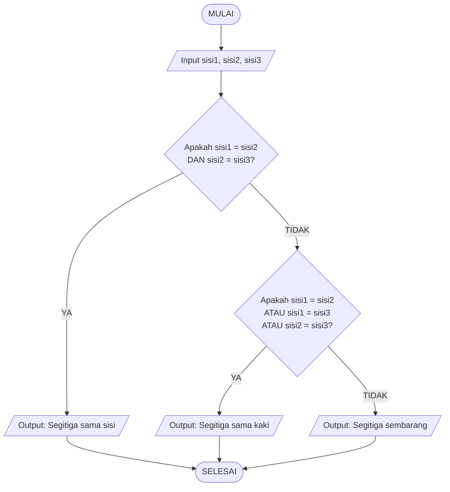

# Madiha-KELAS-3E-ALGORITMA-PEMOGRAMAN
Tugas Algoritma Pemograman

# 🧮 Menentukan Jenis Segitiga

## 1. Deskripsi Masalah

Dalam pembelajaran matematika SMP, siswa mempelajari materi bangun datar, salah satunya adalah segitiga. Segitiga dapat dibedakan berdasarkan panjang sisinya menjadi tiga jenis, yaitu **segitiga sama sisi, segitiga sama kaki, dan segitiga sembarang**.

Program akan menerima panjang ketiga sisi sebuah segitiga sebagai input. Kemudian, program menggunakan logika kondisi **`if`**, **`elif`**, dan **`else`** untuk menentukan jenis segitiga berdasarkan kesamaan panjang sisi-sisinya.

- Jika ketiga sisi memiliki panjang yang sama, maka segitiga tersebut merupakan **segitiga sama sisi**.
- Jika hanya dua sisi yang memiliki panjang sama, maka segitiga tersebut merupakan **segitiga sama kaki**.
- Jika ketiga sisinya memiliki panjang yang berbeda, maka segitiga tersebut merupakan **segitiga sembarang**.

---

## 2. Identifikasi Input, Proses, dan Output

| **Komponen** | **Keterangan** |
|---|---|
| **Input** | • Panjang sisi pertama.<br>• Panjang sisi kedua.<br>• Panjang sisi ketiga. |
| **Proses** | Program membandingkan panjang ketiga sisi menggunakan kondisi logika:<br><br>• Jika sisi 1 = sisi 2 **dan** sisi 2 = sisi 3, maka segitiga sama sisi.<br>• Jika sisi 1 = sisi 2 **atau** sisi 1 = sisi 3 **atau** sisi 2 = sisi 3, maka segitiga sama kaki.<br>• Jika semua sisi berbeda, maka segitiga sembarang. |
| **Output** | Jenis segitiga berdasarkan panjang sisi. |

---

## 3. Pseudocode

```text
INPUT sisi1
INPUT sisi2
INPUT sisi3

IF sisi1 = sisi2 AND sisi2 = sisi3 THEN
    OUTPUT "Segitiga sama sisi"
ELSE IF sisi1 = sisi2 OR sisi1 = sisi3 OR sisi2 = sisi3 THEN
    OUTPUT "Segitiga sama kaki"
ELSE
    OUTPUT "Segitiga sembarang"
END IF
```

---

## 4. Flowchart



---

## 5. Implementasi Python

```python
sisi1 = int(input("Masukkan panjang sisi 1: "))
sisi2 = int(input("Masukkan panjang sisi 2: "))
sisi3 = int(input("Masukkan panjang sisi 3: "))

if sisi1 == sisi2 and sisi2 == sisi3:
    print("Segitiga sama sisi")
elif sisi1 == sisi2 or sisi1 == sisi3 or sisi2 == sisi3:
    print("Segitiga sama kaki")
else:
    print("Segitiga sembarang")
```

---

## 6. Pengujian Program

### Test Case 1 — Segitiga Sama Sisi

**Input:**

```text
Masukkan panjang sisi 1: 6
Masukkan panjang sisi 2: 6
Masukkan panjang sisi 3: 6
```

**Output:**

```text
Segitiga sama sisi
```

### Test Case 2 — Segitiga Sama Kaki

**Input:**

```text
Masukkan panjang sisi 1: 5
Masukkan panjang sisi 2: 5
Masukkan panjang sisi 3: 8
```

**Output:**

```text
Segitiga sama kaki
```

### Test Case 3 — Segitiga Sembarang

**Input:**

```text
Masukkan panjang sisi 1: 3
Masukkan panjang sisi 2: 4
Masukkan panjang sisi 3: 5
```

**Output:**

```text
Segitiga sembarang
```

---

## 7. Tabel Pengujian

| **No.** | **Sisi 1** | **Sisi 2** | **Sisi 3** | **Kondisi** | **Hasil** |
|---|---:|---:|---:|---|---|
| 1 | 6 | 6 | 6 | Semua sisi sama | Segitiga sama sisi |
| 2 | 5 | 5 | 8 | Dua sisi sama | Segitiga sama kaki |
| 3 | 3 | 4 | 5 | Semua sisi berbeda | Segitiga sembarang |

---


8. Hasil Pengujian


